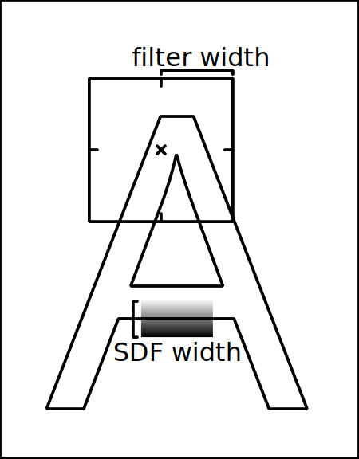

# File Format

The file format used by this Udon script is designed to encode:

* A metadata JSON object
* A palette, consisting of 4-byte RGBA (non-premultiplied, non-linear) colours
* A series of _atlases_
	* Represents a single compiled image file.
	* Contains a set of _shapes_
		* Each shape refers to a region on the atlas, and provides a fixed size in page-size units.
* A series of _pages_
	* Has a size and refers to a single _atlas_
	* Contains a list of _sprites,_ referring to _shapes_ in the referred-to _atlas_
		* Each sprite is a single-colour opaque object.
		* Sprites are drawn in the order they are provided.
		* Colour and translation is per-sprite, but there's no mechanism for scaling, rotation, etc.

It uses several different forms of unit:

* 'Reference space', which matches the incoming SVG files.
* '`int16` reference space', which is the result of:
	1. dividing a reference-space coordinate by the page size
	2. multiplying it by `32767.0`
	3. clamping
	4. converting to `int16`
* '`float` UV space', 0,1 being top-left and 1,0 being bottom-right.
	* The Y is inverted here because it'd need to be done in the Udon code otherwise, and if you've seen it, you know why I don't want to do that.
* '`uint16` UV space', which maps 0-65535 to 0-1.

## Versioning

Upper 8 bits of version are major. Current version is `0x0100`.

`kvbookLoader.uasm` will accept versions 0x0100 through 0x01FF inc.

Loaders will support all sensible files of a given major version. With this said, it is unlikely for the major version to change in future, as there are no longer any format changes worth making.

## Header

The binary file format starts with a header:

```
// kvtoolsLoader reads atlas_count and version fields as one int32, then ANDs/shifts accordingly.
uint16_t atlas_count;
uint16_t version;
uint32_t page_count;
lump_t metadata;
lump_t palette;
lump_t atlases[atlas_count];
lump_t pages[page_count];
```

`lump_t` is a simple offset/length pair:

```
uint32_t offset;
uint32_t length;
```

The metadata lump is a JSON UTF-8 string, not null-terminated.

It is guaranteed to parse as a JSON object, but is considered application-specific data.

The palette lump is pretty simple:

```
struct {
	uint8_t r, g, b, a;
} palette[...];
```

Each atlas lump contains 'shapes'. These contain regions on the actual atlas texture, along with a reference size to display at.

```
struct {
	uint16_t u, v; // uint16 UV space
	float w, h; // Reference space width/height
} shapes[...];
```

Page lumps contain a short header giving the reference size of the page (seemingly _theoretically_ in millimetres for PDF content, but anything goes) followed by 'sprites'.

```
uint8_t atlas;
float width, height; // defines the page size, which is also the extent of reference space, and therefore the extent of quantized reference space
struct {
	uint16_t shape; // shape ID in atlas
	int16_t x, y; // position in int16 reference space
	uint16_t colour; // colour index in palette
} sprites[...];
```

Note that the size of the sprite structure is the primary driver of the binary format's file size.

## SDF Rendering Notes

This describes the image arrangement for the SDF.

The SDF data is contained in the alpha channel.

For valid atlas regions, the colour data must be black, as the presence of the blue colour may be used as a signal in the shader to indicate truecolour image rendering. (Truecolour pixels are passed through to fragment colour/alpha _as-is_ for traditional blending. Black was chosen so that a non-truecolour atlas will be stable even in somewhat erroneous pipelines; a pure-black input will always decode as such even under compression or alpha premultiplication.

Some key facts of the SDF transform are that:

1. A key rendering property of the SDF is the 'line width'. This is the width in texture pixels from the centre of the outline (a=0.5) to a=0 or a=1.
2. We need to determine the 'filter width'. This is how big the 'hypothetical ideal box filter' is in texture pixels.
3. We need the 'desired blurriness'. This is a multiplier on the filter width (and can also paper over any implementation quirks).
4. From these facts, we determine the 'range': the acceptable +/- deviation from the typical threshold of 0.5.



The original design considered the Unity TextMeshPro Mobile shader as the 'reference model' for rendering. However, it does **not** appear use the `fwidth()` mechanism recommended by Valve for antialiasing, instead determining scale by the vertex W parameter and the second texture coordinate input.
