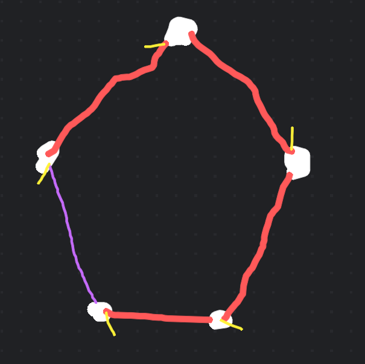
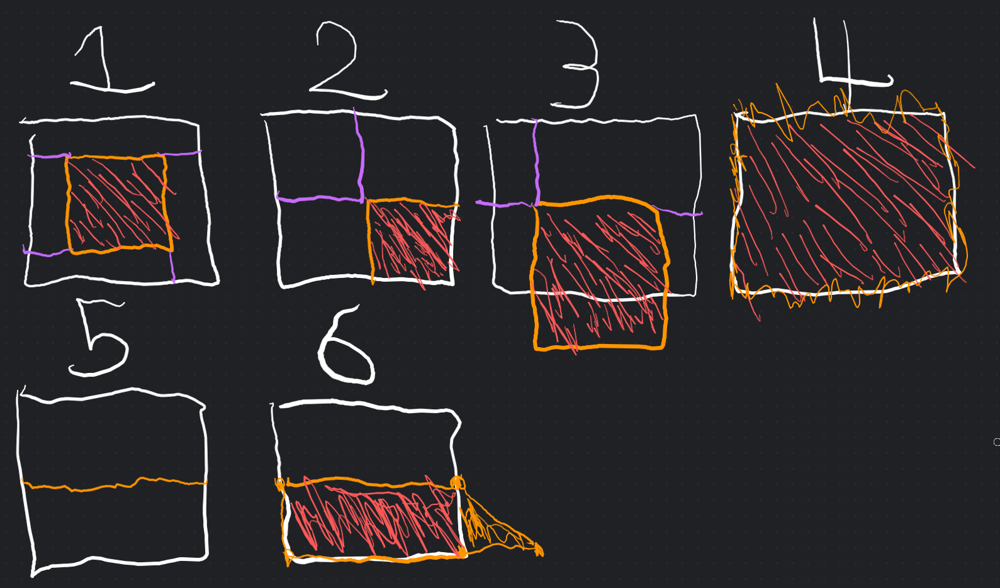

# Notes on the KDCVRCBSP 'ECL' Compiler

The Quake-style MAP/BSP toolchain is an easy-to-operate auto-optimizing mechanism for producing game maps.

However, usually these are derived from the QBSP lineage.

These are my personal notes on the process of producing a BSP compiler library, specialized for the goal of VRChat world development.

The result is arguably incomplete for Quake use, but as complete as it needs to be for Unity which can't use most of its capabilities anyway.

This library is philosophically closest to Quake 1 QBSP, though it is somewhat distinct, intentionally (for various reasons) and unintentionally (for other various reasons).

In particular:

* There's no 'contents flag enum', though there are surface flags which have whole-brush effects in the same way surface flags transfer to contents. Check for reads from `Geo2BrushInfo.allSurfaceFlags`.
	* In practice, these are `Detail`, `MarkBrushOrigin`, `DeleteBrushAfterAABB`, and `MarkBrushIllusionary`.
	* Being a very surface-based BSP system, the ECL
* The 'chop stage' focuses entirely on faces and not at all on brushes.
	* Generally there is a merge phase, and some compilers seem to merge chopping with BSP and do all sorts of other craziness, and it just seems like a really awkward mess, especially given we're on accelerated Z-buffered graphics and don't actually care about using the BSP tree for draw order.
		* With this said, attempting to avoid the merge phase in this compiler has lead to some questionable geometry. Controlling chop order has managed to prevent problems here from piling up so far.
	* A key invariant I wish to preserve is that an areaportal face is entirely and completely unimpeded in its ability to both not be chopped and in its ability to chop any eligible face. This is because the sides of areaportals will eventually become _separate meshes entirely,_ so having any common faces between them will result in unnecessary overdraw (or worse).
		* This is to say, while we usually want to chop _less_ than Quake 2 QBSP (only faces that are hidden or overlapping, to reduce overdraw and to avoid lighting problems or z-fighting), in the case of areaportals, we actually need to take drastic action and chop absolutely anything along their edges.

## Core Mathematical Primitives

The following mathematical primitives neatly define everything to do with MAP/BSP processes.

Firstly, there are 3D vectors; the higher precision the better, during processing. There are also normal vectors, which are 3D vectors of length 1.

Secondly, there are 3D planes. These are infinitely-sized rectangles that can be defined as a normal vector and a (signed) distance from the origin. Based on the results of the dot product, it is reasonable to assume positive distances indicate upward (relative to the plane) movement; _this is not a universal assumption among geometry libraries._ (It appears Godot uses this definition while Unity uses a negated distance for some unknown reason. The geometry library you may have received with this document uses Godot's definition, as it is more obviously sensible.)

The signed distance between a point and a 3D plane is defined here as `(dot(point, plane.normal)) - plane.distance`. Results above 0 are above the plane; below 0 is below the plane.

A key set of rules regarding 'map planes' (those planes which come from the map) and only those planes: Map planes and their flipped variants should be deduplicated _as soon as reasonably possible._ (The code that comes with this document does this in `Geo2`.) This is because it centralizes all cross-plane coplanarity checks, an extremely common operation, in one body of code.

Some useful operations to support are:

1. Cast point to plane along plane normal
2. Cast point to plane along arbitrary normal ('travel vector')

Thirdly, there are windings.

Windings are a set of 3D vectors with a common plane. In a language like Rust, windings should be generic to allow additional data. In a language such as C#, separate versions of relevant winding-related functions should exist for windings with metadata. Metadata is an uncommon but extremely useful feature.

While the associated plane of a winding _can_ be inferred, the function to do so should only be called under specific circumstances. See notes on map planes earlier.

This is _the_ core datastructure. While it is possible to build various parts of a BSP compiler using methods such as tri-plane intersection, windings provide an underlying 'universal theory' that can define much of the operation of a BSP compiler.

The following diagram illustrates an example pentagonal winding. Each point (white) is considered the starting point of a line that extends to the next point (direction indicated with yellow marker); the winding is a loop (purple line), so there are as many lines as there are points.

Key assumptions that prevent much in the way of subtle issues are:

1. Two lines within the same winding will never be co-linear.
2. Windings are convex.
3. Windings with 2 or less points do not represent shapes with area and are purged as soon as possible in most cases.
	* These 'windings' may still be useful in certain situations, i.e. for computing the presence of a winding-winding intersection.

It should be possible for winding points to have associated data. This is one of the methods of determining winding completeness.

The following operations on windings are important:

1. Create square winding of a given size centred on the origin that lives on the given plane.
	* Given that such a winding will typically end up being created axis-aligned, it's possible to anchor the resulting points either using the plane normal or using the axis normal. I recommend the axis normal; it's slightly more computationally expensive, but this operation is really only done in the potentially parallelizable brush-cut stage, and prevents needing to add headroom to avoid '45 degree' issues. The reduction in general mathematical chaos should hopefully reduce precision issues.
2. Separate a winding into up to two windings (below and above sections) according to a 'cutting plane'. The cut may carry metadata, which is attached where the cut bridged two vertices, or where a line is completely on-plane.
3. Confirm if a plane would 'cut' the below section of a winding, miss, or if it would destroy it entirely.
4. Converting a winding to its bounding planes (as if a prism) by using the winding normal and the cross product.

Most important to manipulate MAP files at all are operations 1 and 2. This is one of the only ways (and arguably the only _reasonable_ way) to parse the brush planes into any useful geometry at all. This implies that a fixed 'map size limit' must be introduced beyond which the initial windings don't extend, creating an unclosed shape. Still, without 'making a big square', there's very little to cause the point order to fall into place.

Fourth and finally are convexes.

Convexes are a convenient packaging of a set of windings with planes and per-plane metadata. This, along with having a cut function which also adds a new winding if appropriate (Or splits the convex in two. The only time a convex will be split is if it's being split by a leaf boundary; other cases will split individual convex _faces_), is all they should be doing.

It's also useful to have convex faces be a separate entity from convexes. This is because a convex face, with metadata, can be passed around and cut-up versions made independently of the host convex. This is extremely useful in the 'chop stage'.

### Maths: Some Things Not To Do

**Don't try to avoid making big squares.**

The 'making a big square' situation is also _solvable_ by relying on the convex nature of the winding to determine the next point as whichever point no points not already reached exist above; this, assuming an exhaustive search for points via tri-plane intersection, will create reliable point orders of random 'flippiness'. 

To be frank, every part of this approach screams trouble. Still, if you hate yourself that much, please refer to <https://gitlab.com/20kdc/20kdc_godot_addons/-/blob/85b942b84ebedebb3ff241b72309f008ae0db7f2/godot3/addons/map_io/maths/base.gd#L130> (`winding_from_points`). This function is pure evil and should not be used.

**Don't make big cubes.**

The convex representation from that same old project initialized to a big cube, and then would grab the 'cut-point' points and make a new face from them, rather than simply creating one big winding per target plane and cutting it up. 

This is tempting because it looks more mathematically stable on the surface, and provides a good reason why the geometry should be consistent.

The problem is that now you're left with a bunch of unordered cutpoints which you have to make into a valid winding via an awkward and slow process.

The answer I would go with these days is to either snap vertices to a given precision at the end of compilation, or to reduce the size of the initial windings, as this is the biggest factor. A possible workaround exists in running a low-precision wide-range cut to then determine where to create a much more precisely placed winding set.

## Basic Outline Of Compilation

The basic outline is as follows:

1. Read the map. Textures are mapped into `IBSPMaterial` here by the embedder.
2. Preprocessing stage.
	1. TrenchBroom export simulation. This simulates the TrenchBroom Export Map feature. (`TrenchBroom.FullSimulateExport`)
	2. Group processing and plane stability. (`BSPHighLevel.Act1_MapIntoGeo2`)
		* This creates the `Geo2Map`, the object on which compilation is performed.
		* Ensuring plane stability here decreases the chance of vertex misalignments, as operations will be using mostly consistent numbers.
		* This is where per-brush metadata begins to exist (pulled from merged `func_group`s).
		* The following key things happen in the constructor of `Geo2Map.BrushEntity`:
			* Brush sorting (for chop stage)
			* Origin processing (auto-origin, origin key, and origin brushes)
				* Auto-origin simply treats all brushes as origin brushes for origin calculation purposes. This leads to 'usually sensible' effects.
			* Removal of brushes which are destined for removal after AABB stage
			* Conversion of brushes into convexes.
3. Per-entity compilation. (`BSPHighLevel.Act2_Compile`)
	1. Chopping. All brush faces are chopped, if applicable, and the results pooled into two lists of brush faces.
		* _**Brushes escape past this point for collision, but otherwise cease to exist; all further effort works with a face-based representation.**_ (The brushes are needed up to here for chopping purposes; a solely face-based chop stage doesn't have the necessary guarantees to 'punch out' a surrounded face.)
		* One list is for 'split faces', and the other for 'detail faces'. If there is no reason to care, these may be the same list.
	2. For brush entities, a single area is filled with 'collider faces'. For worldspawn only, partitioning:
		1. Partition it into a binary tree of leaves.
			* Leaves are convexes which contain mutable lists of 'portals' (connections between leaves).
		2. Compute portals, turning the list of leaves into a connected graph.
			* An important trick here is to mark faces that cover a portal. The surrounding faces will have carved one side or the other of the portal, so any contact of a face will be total unless the situation is ill-formed.
		3. Determine which leaves are actually going to survive, which are separated by areaportals, etc.
			* Areaportals in this setup are intended to create separate render meshes. Only Unity occlusion can actually occlude avatars without causing compatibility risks with world logic, so we need to tread carefully, like a mouse in a trap recycling facility.
		4. The separated leaf areas are then filled with 'collider faces'.
4. Post-processing. (`BSPHighLevel.Act3_Postprocess`) For each entity:
	* 'Collider faces' are copied and T-junction-processed into 'render faces'.
	* Some collider faces are removed (if they shouldn't actually be collider faces).
	* Some render faces are not created (if they shouldn't actually be rendered).
	* Not all render faces are necessarily T-junction-processed or necessarily contribute to T-junction processing.

Finally, certain processes happen outside of the ECL, like deleting `noclip` brushes. (This is for code consistency with the Q2 BSP import.)

## Chopping

Chopping in this library is entirely face-based, similar to QBSP1. The details of the approach, however, are different.

`Convex3d.ChopFaces` is the core of the face chopper. It's run on a brush to get a list of post-chop faces, and takes in the full list of brushes (including the original brush) in chop order.

The basic problem to solve here is what happens when one brush clips into or onto another; the actual chop algorithm is handled on a brush by brush basis, with 'misses' returning the original list unaltered.

These are the various cases:

1. Internal overlap; the area in red has been subsumed by the brush in yellow.
2. Partially internal overlap. 1, but some sides are on-plane.
3. Partially external overlap.
4. Complete overlap.
5. 'Touch-cut'.
6. Intersect with potential mis-cut slope plane

The striped areas in red are occupied by a brush that is either:

* Touching the target face.
* Clipping straight through it.
* Overlapping the face (same facing direction).

In case 6, the brush covering the yellow and red zones clips into the lower part of the brush, but not into the upper part. We would like to _not_ chop the upper part for efficiency reasons.

It follows that we must be very careful to track which planes _actually_ intersect our brush. We must also be careful to keep track of planes which aren't allowed to chop, but are still needed to prevent other planes 'escaping' and causing chops they shouldn't.

To achieve this, the library runs a hypothetical using a winding-with-metadata, the metadata being a boolean. This winding starts with the pre-chop face, all set to true, and then cuts it using the cutting brush's planes, with the flag set according to if a chop is permitted.

A plane which matches the face plane sets an `overlapped` flag and doesn't cut; a plane which is the inverse does not set the flag, but still doesn't cut.

Otherwise, in on-plane cases (brushing against an existing edge), the answer is the OR of either input, though this will almost never matter.

If the final intersection winding collapses, processing aborts here and no chop is performed. Otherwise, the intersection winding is turned into planes with bools (the metadata persisting).

Those planes are then sorted by if they're axis-aligned or not; axis-aligned planes go first. This is a heuristic to try and produce better geometry.

The old face is then cut up with each plane that is _permitted_ to chop (boolean is true). The faces that are 'definitely outside of the intersection' (above the planes) are put into the final face list. The faces below keep being worked on. If a plane that is not permitted is encountered, it is skipped and a flag is set to register incompleteness.

The question that remains is what to do with the faces that remain inside the allowed-to-chop portion of the intersection winding.

That portion is put into the final face list if and only if at least one of these cases apply:

* If the overlapped flag is set and the cutting brush is after the current brush in chop order. (Past cutting brushes take priority through successive chopping; this is where it stops, and instead the cutting brush is expected to eventually lose its face.)
* If the cut was incomplete, then the chop has only cut the result, so we keep the faces.

## Partitioning

Partitioning in this library is implemented in a somewhat dodgy way.

The goal here is build speed, as the actual BSP tree won't get used for anything.

The face list is sorted so that axis-aligned planes are always first in the split order. This is to 'contain' the possible damage from miscalculation. The other criteria is plane distance from the average of the AABB centre of each face passed to the sorter. The idea here is that the mechanism will prioritize the centre of a level first to reduce tree depth, and then promptly fail into a near-linear tree, with more complex (i.e. non-AA) faces being kept as close to the leaves as possible.

Another goal was to outright delete; rather, not create; solid leaves. This means they don't have to be considered for portalization or any future stage.

The basic build function receives a list of 'split faces' and a list of 'other faces'. It picks a plane using the split faces list and then splits these lists into above/below sub-lists. However, on-plane faces; since they include the split face itself, among other problems; are also sent to the 'other' list.

The 'other' list is _not_ detail. (It's used for that, but it's not exclusively detail.) It is just the list of faces that won't split. Where this becomes important is when it comes to leaf creation.

When creating a leaf, every plane leading up to that leaf (which bounds the leaf) is checked for how it relates to faces. Outward-facing solid faces cause the leaf to not be built, returning null; the BSP tree auto-simplifies accordingly. A particular side-effect is that in any solid geometry, a naive query will pick a quasi-random non-solid leaf. However, since leaves carry their real bounding convexes with them, in borderline cases, the find function tries to pick the _closest_ leaf instead.

(This matters because the presence of entities will be used later to determine gameplay areas versus deletable out of world stuff. Entities may be placed directly on solid surfaces, so we need to give them a little nudge to prevent them becoming a bizzare leak.)

## Connecting Leaves

This is handled in `BSPNode.Portalize`, and modifies the lists in leaves that were installed during partitioning.

In order to 'portalize' (connect leaves) the map, the library iterates over all undirected pairs of leaves for opposing faces that are close enough to be viable.

For each candidate, cut up a copy of leaf A's face with winding-to-planes of leaf B's face winding. If the result is a viable winding, note that it is impossible by construction for any other face pair to exist between these two leaves.

If there's a viable winding, it then has its planes extracted. All faces within either leaf that are on the plane or flipped plane are checked against this winding for viability; if viable, it's added.

## Dead-leaf elimination & areaportal separation

The leaf network can now be navigated for a lot of very useful purposes. The `BSPLeaf.Explore` function crawls the leaf network, adding newly found leaves into a leaf list.

It takes a predicate, which is used to indicate if it is allowed to go through a given `(leaf, portal)` pair. This predicate is expected to potentially have the side-effect of marking the leaf on the other side as 'for future exploration' in another exploration pass.

Determining what to use this for is left for the caller (read: the Unity code that will have to clean up after all this) to worry about, but the basic idea is that this is one of the two ways that will be used to split up 'areaportal sections', with the other being the presence of entities in the first place. That is, entities and areaportals will both contribute to the set of leaves that are 'known-reachable-somehow', and 'Explore' will determine an entire section of the map; repeat until all reachable sections are covered, and you have a somewhat occlusion-friendly map.

## T-junction processing

Realistically, this is an element of a 'geometry post-process' stage that handles anything that's the last step before user code gets to play with the data; tasks like vertex-lighting-split might go here if they can be justified for the target.

In short, all of the vertices produced so far are amassed into a point cloud.

Just before geometry output, each winding edge is then tested to see if a point in the cloud is on the edge but not at either of its endpoints. If this is the case, a vertex is inserted. This is done in a points-outer winding-inner configuration in the current setup, because most points will be rejected by the AABB check. If a proper point tree datastructure is added, this'll be swapped around again.

