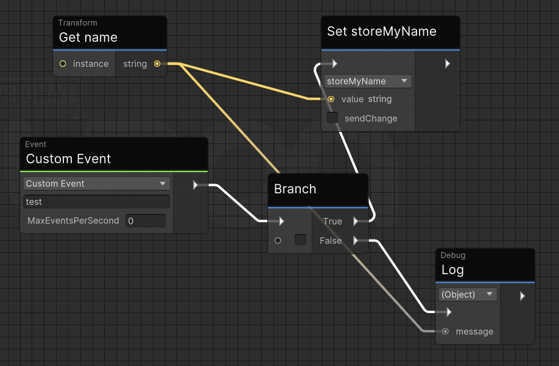
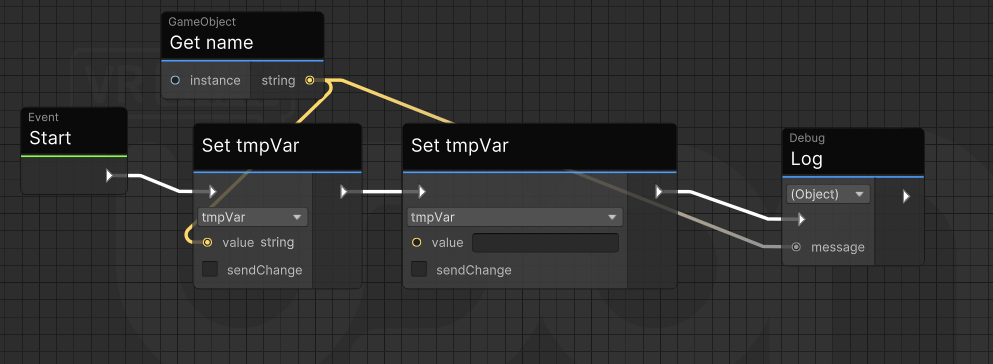
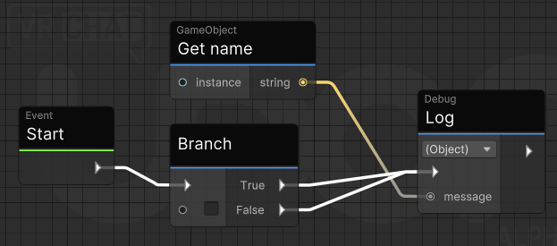
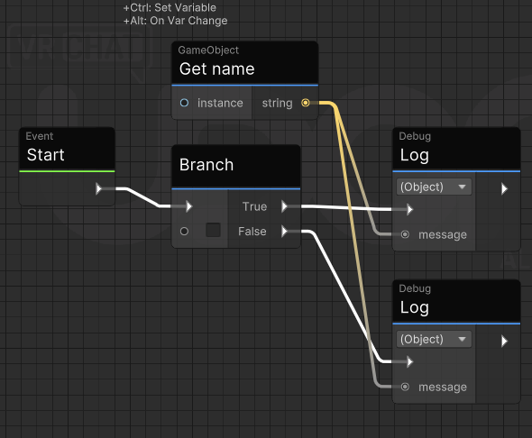

# Udon Tips, Tricks, And Quirks

## Udon Behaviour Surprising Behaviours

* Udon **_really_** likes to automatically fill public variables with `Self`. **This has in at least one instance accidentally created a 'forkbomb' effect wherein a behaviour recursively instantiated copies of itself.**
	* You should pretty much always be using `Transform.Find` to locate subobjects during `Start`.
	* It's possible to add a private `Unity Object` variable in Udon Graph and set its default to the prefab you want. This causes you to have to remove a public variable it automatically creates, and then restart Unity because Udon Graph bricks itself when you do this.
* If a PlayerObject instantiates a pickup, and that pickup is parented under the PlayerObject, it gains PlayerObject 'theft protection' -- _even if it isn't desired._
* If you're poking any other player's `PlayerApi`, ClientSim is nearly useless. Immobilize will throw an exception for other players despite all players seemingly also being `isLocal`.
	* You can, technically, survive this situation on Linux if you have 16GB of RAM _and an SSD_ by using befuddledlabs's patch to get two-player testing working, and then closing Unity as VRC starts to free up just enough RAM to keep things playable.

## Udon Graph Compiler Bugs

The Udon Graph compiler contains a number of 'interesting behaviours' (bugs).

These are kept in `kvassets/Assets/compilerBugZoo`.

### `quantumVariables`



Annotated compiled code:

```
PUSH, __Boolean_0 # 0x00000000
JUMP_IF_FALSE, 0x00000030 # 0x00000008

# true: get name into storeMyName (compiled correctly, b/c first in compile order)
PUSH, __instance_0 # 0x00000010
PUSH, storeMyName # 0x00000018
EXTERN, "UnityEngineTransform.__get_name__SystemString" # 0x00000020
JUMP, 0x00000054 # 0x00000028

# false: log name -- 'fastpaths' into using storeMyName, because it's 'already stored there'.
PUSH, storeMyName # 0x00000030
PUSH, __message_0 # 0x00000038
COPY # 0x00000040

PUSH, storeMyName # 0x00000044
EXTERN, "UnityEngineDebug.__Log__SystemObject__SystemVoid" # 0x0000004C
JUMP, 0xFFFFFFFC # 0x00000054
```

The following miscompilations happen here:

1. The complete omission of getting the name at all on the false branch, because it's 'already' gotten in the true branch.
2. (minor, but in Udon performance is a big deal) `__message_0` copy is unnecessary because of the direct push optimization.

### `staleGet`



Annotated compiled code:

```
PUSH, __instance_0
# Note the lack of an intermediate variable.
PUSH, tmpVar
EXTERN, "UnityEngineGameObject.__get_name__SystemString"

# Overwrite with empty string.
PUSH, __tempValue_0
PUSH, tmpVar
COPY

# Oops, pointless copy again.
PUSH, tmpVar
PUSH, __message_0
COPY

# And now use the wrong source.
PUSH, tmpVar
EXTERN, "UnityEngineDebug.__Log__SystemObject__SystemVoid"
JUMP, 0xFFFFFFFC
```

1. `tmpVar` being overwritten does not prevent the get-from-result optimization, resulting in much chaos.
2. The `__message_0` copy bug again.

### `brokenConvergence` and `brokenConvergence2`



Annotated compiled code for `brokenConvergence`:

```
PUSH, __Boolean_0
JUMP_IF_FALSE, 0x00000040

PUSH, __instance_0
PUSH, __message_0
EXTERN, "UnityEngineGameObject.__get_name__SystemString"
PUSH, __message_0
EXTERN, "UnityEngineDebug.__Log__SystemObject__SystemVoid"
JUMP, 0x00000064

PUSH, __message_0
PUSH, __message_1
COPY
PUSH, __message_0
EXTERN, "UnityEngineDebug.__Log__SystemObject__SystemVoid"

JUMP, 0xFFFFFFFC
```



Annotated compiled code for `brokenConvergence2`:

```
PUSH, __Boolean_0
JUMP_IF_FALSE, 0x00000040

PUSH, __instance_0
PUSH, __message_0
EXTERN, "UnityEngineGameObject.__get_name__SystemString"
PUSH, __message_0
EXTERN, "UnityEngineDebug.__Log__SystemObject__SystemVoid"
JUMP, 0x00000064

PUSH, __message_0
PUSH, __message_1
COPY
PUSH, __message_0
EXTERN, "UnityEngineDebug.__Log__SystemObject__SystemVoid"

JUMP, 0xFFFFFFFC
```

The basic principle behind `brokenConvergence` is that Udon Graph compiles converging flow nodes as if they were two compilations of the same nodes.

That is to say, it **doesn't** attempt to actually 'reconcile' the nodes in any way (i.e. jumps). There are some mechanisms to prevent infinite recursion during compilation (i.e. you can't connect a node to its source), but that's it.

`brokenConvergence2` gives a precise comparison; a separate node gets its own input temporaries, and this shines some light on how the value-reuse optimization is **intended** to work when not being misused on user-accessible variables.

### Conclusions

The Udon Graph compiler attempts various optimizations in a flawed manner that can lead to particularly consequential miscompilations. In particular:

* All value reuse optimizations do not account for the existence of branching.
	* Something that was confirmed to be okay is that the optimization caches are independent _per event._ This implies there is a clear way to 'revert' the cache during compilation, which is the only necessary criteria to fix the optimization (as opposed to removing it entirely).
* The 'value reuse optimization' assumes that if a node output is _first_ written to a user-provided variable, that user-provided variable will not change.
* Copies to parameters which have been 'bypassed' by pushing their sources directly are not elided.
